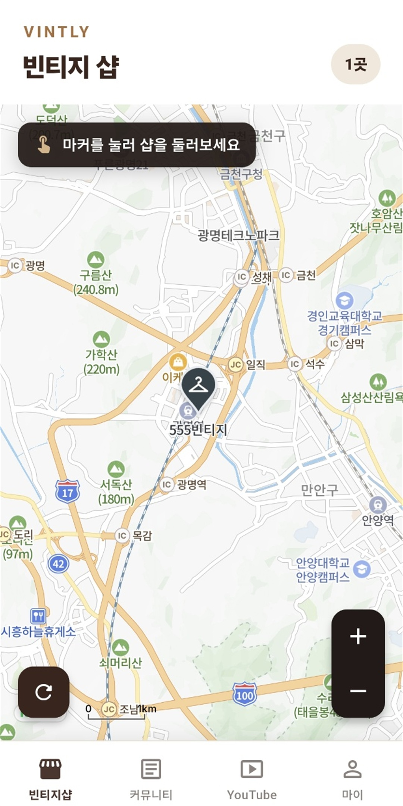
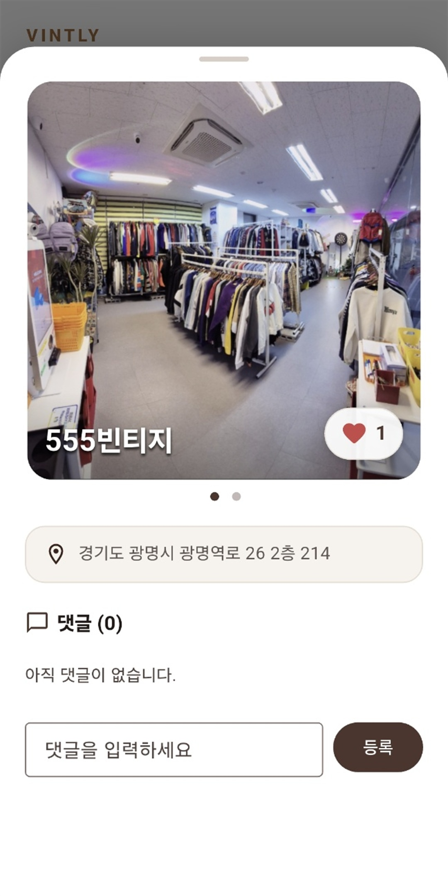
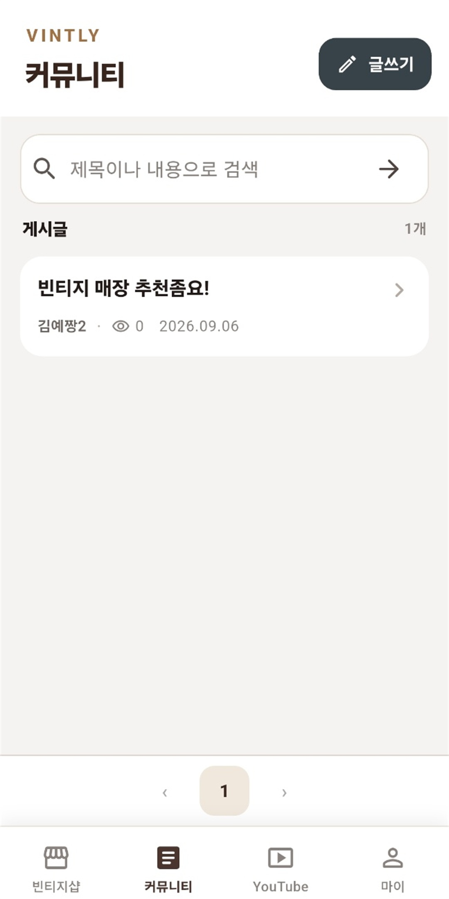
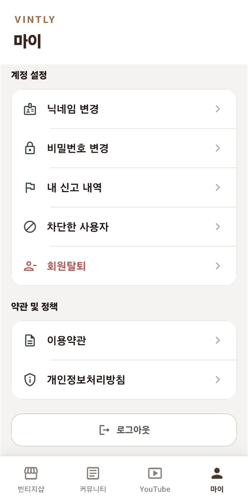

# Vintly

빈티지 샵 위치·정보를 공유하고, 좋아요와 댓글/대댓글로 소통하는 모바일 앱입니다.

## 기능

- **회원가입 / 로그인** – 이메일·비밀번호·닉네임 기반, access/refresh 토큰 저장
- **빈티지 샵 목록** – 지도에 마커로 표시, 목록 API 연동
- **빈티지 샵 상세** – 마커 탭 시 바텀시트로 이미지·이름·주소·좋아요·댓글 표시
- **좋아요** – 좋아요 토글 (POST/DELETE)
- **댓글·대댓글** – 댓글 작성 및 답글(대댓글) 작성

## 앱 화면

| 빈티지 숍 지도 | 매장 상세 | 커뮤니티 | 마이·계정 관리 |
| :---: | :---: | :---: | :---: |
|  |  |  |  |

스크린샷과 스토어 등록용 그래픽은 [스토어 이미지 안내](docs/안드로이드-출시/store-assets/README.md)에서 확인할 수 있습니다.

## 기술 스택

- **Flutter** 3.x, **Dart** ^3.11.0
- **지도**: flutter_naver_map (네이버 Dynamic Map)
- **인증 저장**: flutter_secure_storage
- **네트워크**: REST API (dart `http` 기반 `ApiClient`), 401 시 자동 reissue 후 재시도

## 실행 방법

### 1. 저장소 클론 및 의존성 설치

```bash
git clone <repository-url>
cd vintly_app
flutter pub get
```

### 2. 백엔드 API 주소 설정

백엔드 baseUrl은 환경별로 다음 파일에서 설정합니다. (이 파일들은 `.gitignore`에 포함되어 있으므로, 프로젝트에 없으면 직접 생성해야 합니다.)

- `lib/config/backend_local.dart` – 로컬 개발
- `lib/config/backend_dev.dart` – 개발 서버
- `lib/config/backend_prd.dart` – 운영 서버

각 파일은 `backend_config.dart`의 `BackendConfig`를 사용해 환경, API 주소와 네이버 Maps Client ID를 설정합니다. 예시:

```dart
import 'backend_config.dart';

const backendConfig = BackendConfig(
  env: AppEnv.dev,
  baseUrl: 'https://your-api-host.com',
  naverMapClientId: 'YOUR_NAVER_MAP_CLIENT_ID',
);
```

### 3. Android 업로드 키 설정

`android/key.properties`와 업로드 키 파일은 보안상 Git에 포함되지 않습니다. 저장소를 새 PC에 클론하거나 다른 개발 환경에서 Android 앱을 실행할 때는 `android/key.properties`를 직접 생성해야 합니다.

```properties
storePassword=실제_keystore_비밀번호
keyPassword=실제_key_비밀번호
keyAlias=upload
storeFile=업로드_키의_절대_경로
```

`storeFile`에는 해당 PC에서 접근 가능한 실제 `.jks` 파일 경로를 입력합니다. 현재 Gradle 구성에서는 이 파일이 없으면 debug 실행을 포함한 Android 빌드 설정 단계가 중단됩니다.

비밀번호, `key.properties`, `.jks` 및 `.keystore` 파일은 README나 소스 코드에 실제 값으로 기록하거나 Git에 커밋하지 마세요. 상세 생성 절차는 [`docs/안드로이드-출시/CHECKLIST.md`](docs/안드로이드-출시/CHECKLIST.md)를 참고하세요.

### 4. Android NDK 설정

Android 앱 빌드에는 NDK `28.2.13676358` 버전이 필요합니다.

1. Android Studio에서 **Tools > SDK Manager**를 엽니다.
2. **SDK Tools** 탭에서 **Show Package Details**를 선택합니다.
3. **NDK (Side by side) > 28.2.13676358**을 선택하여 설치합니다.
4. NDK 설치 중 `sdkmanager` 오류가 발생하면 **Android SDK Command-line Tools (latest)**도 설치하거나 재설치합니다.

### 5. 앱 실행

- 기본(개발 환경): `flutter run` 또는 `flutter run -t lib/main_dev.dart`
- 로컬 백엔드: `flutter run -t lib/main_local.dart`
- 운영 환경: `flutter run -t lib/main_prd.dart`

`main.dart`는 현재 `backend_dev`를 사용하도록 되어 있을 수 있으므로, 필요 시 `lib/main.dart`에서 import하는 config를 변경하면 됩니다.

### 6. Android 데모 APK 빌드

개발 서버에 연결되는 데모 APK는 다음 명령으로 빌드합니다.

```bash
flutter build apk --release -t lib/main_dev.dart
```

환경별 빌드 명령은 다음과 같습니다.

- 로컬 백엔드: `flutter build apk --release -t lib/main_local.dart`
- 개발 서버: `flutter build apk --release -t lib/main_dev.dart`
- 운영 서버: `flutter build apk --release -t lib/main_prd.dart`

빌드가 완료되면 아래 경로에 APK가 생성됩니다.

```text
build/app/outputs/flutter-apk/app-release.apk
```

생성된 APK를 USB, 클라우드 드라이브 또는 메신저 등으로 Android 휴대폰에 옮긴 뒤 파일을 눌러 설치합니다. 처음 설치할 때는 휴대폰 설정에서 APK를 연 앱에 대해 `출처를 알 수 없는 앱 설치` 권한을 허용해야 할 수 있습니다.

- 실제 휴대폰에서 네이버 지도를 사용하려면 네이버 클라우드 Maps에 현재 Android 패키지명 `com.vintly.app`이 등록되어 있어야 합니다.
- 로컬 백엔드 빌드는 `localhost` 대신 휴대폰에서 접근할 수 있는 PC의 내부 IP를 사용하고, 휴대폰과 PC를 같은 네트워크에 연결해야 합니다.
- release 빌드는 `android/key.properties`에 설정한 업로드 키로 서명됩니다.

### 7. Google Play 등록용 AAB 빌드

운영 서버에 연결되는 Google Play 등록용 Android App Bundle(AAB)은 다음 명령으로 빌드합니다.

```bash
flutter build appbundle --release -t lib/main_prd.dart
```

빌드가 완료되면 아래 파일을 Google Play Console에 업로드합니다.

```text
build/app/outputs/bundle/release/app-release.aab
```

이미 사용한 버전 코드는 다시 업로드할 수 없습니다. 새 빌드 전에 `pubspec.yaml`의 `version`에서 `+` 뒤 숫자를 기존에 업로드한 최대 버전 코드보다 크게 변경합니다. 예를 들어 `1.0.0+3`의 버전 코드는 `3`입니다.

## 프로젝트 구조 (요약)

```
lib/
├── app/                 # 앱 진입점, 라우팅, 테마
├── config/              # 백엔드 설정 (backend_*.dart)
├── features/
│   ├── auth/            # 로그인, 회원가입
│   ├── home/            # 홈(임시)
│   └── vintage/         # 빈티지 목록·상세·좋아요·댓글
└── shared/
    ├── api/             # ApiClient, 인증 API 래퍼
    ├── auth/            # 토큰 저장, reissue
    └── ui/               # 공통 UI (다이얼로그 등)
```

## 문서

- [AGENTS.md](AGENTS.md) – 제품 요구사항·기능 정의·화면·데이터 모델·기술 및 작업 기준
- [docs/decisions](docs/decisions) – 디자인·기술 선택과 근거
- [docs/todo.md](docs/todo.md) – 미완료 작업과 백로그

## 라이선스

Private.
